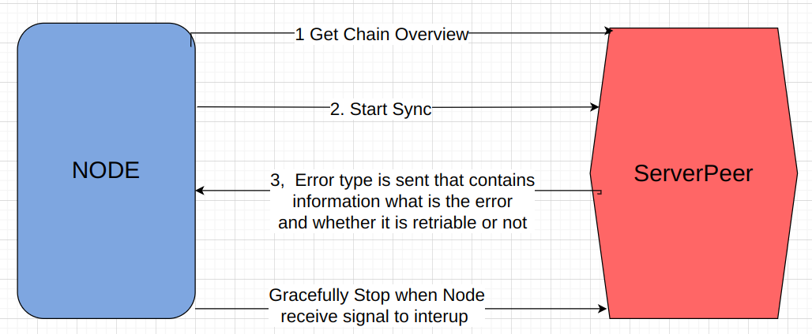

# btc-node
btn-node is an implementation of the Bitcoin protocol in Go. Here is an overview diagram:


## Node
At the top is the Node. When the program starts, it connects to a list of peers. If the server is started for the first 
time, an initial handshake is made with the peers, and the Node runs the chain overview process. 
During this process, GetHeaders messages are sent from the genesis block to the last block in the chain. 
When this process is finished for all the peers, the Node checks the overview status (number of blocks, 
cumulative PoW, validation of the chain) and chooses the chain with the greatest cumulative PoW. For 
example:

Peer 1 has blocks: block1, block2, block3 with a cumulative PoW of 100
Peer 2 has blocks: block1, block2, block3, block4, block5 with a cumulative PoW of 80
Peer 3 has blocks: block1, block2 with a cumulative PoW of 60
The Node will choose to sync with Peer 1. The cumulative PoW is chosen, even though Peer 2 has more 
blocks in its chain. The first network is the most secure of these three.

The Node also runs a goroutine that listens on lower levels. When an error occurs that interrupts the connection with 
the peers, an error message is sent through a channel. The Node handles this error and attempts to reconnect to the peer. 
Here is an overview of the communication between the 'Node' and its 'ServerPeer' instances:




Step 1 - When an outgoing/incoming handshake connection is established and a new ServerPeer instance is created, the Node 
always starts with GetChainOverview. In this first step, the node gets information about what chain the peer contains, 
how long it is, its validity, and the common cumulative Proof of Work (PoW) for all blocks.

Step 2 - If the node decides that this is the best peer to sync with, it initializes a sync process with that peer. See 
the [Sync workflow diagram](#sync-flow) for more details.

Step 3 - If an error arises within any of the goroutines inside the ServerPeer, it is sent to the 'Node'. The error type 
is custom and contains information about the kind of error, where it occurred, and whether it is retryable or not. Based 
on the information inside the error, the Node can decide what to do, such as reconnecting to the peer if the error is a 
network connectivity issue, or stopping the connection and blocking the peer if it sends malicious data or violates the 
Bitcoin protocol.

Step 4 - Finally, the Node can gracefully stop the ServerPeer if it receives a signal to interrupt.

## ServerPeer
When a new connection is established, a new ServerPeer instance is created. ServerPeer runs two goroutines: one for 
listening to incoming messages from the peer and another for outgoing messages that need to be sent to the peer.

Additionally, ServerPeer has methods to trigger the 'sync-overview' and 'sync' processes with the peer.

When a new incoming message is received from the TCP connection, its type is checked and it is routed to its handler.
When outgoing message is received from a channel it is send to the peer through the TCP connection. 

## PeerSync
PeerSync contains the logic for getting an overview of the chain. Based on this overview, the Node can decide whether 
to sync with the peer. Both the Overview and Sync processes always start from the last block saved in the DB. These 
two processes begin with sending an outgoing getHeaders message. Before sending the message, PeerSync sends the block 
hash (the starting block hash) to the headers handler. This ensures the headers handler can identify whether the 
received headers were requested. If not, they will be rejected.

## MessageHandlersManager
MessageHandlersManager maintains a list of handlers. Each handler processes a different message type in a separate 
goroutine. It starts and stops these handlers as necessary.

## MsgHeadersHandler
Handles incoming MsgHeaders. It checks whether the message was requested; if not, it is rejected. If the message is 
expected (requested), it validates the headers, calculates the cumulative PoW, sends an outgoing GetData message, 
and notifies the MsgBlockHandler about which blocks to expect.

## MsgBlockHandler
MsgBlockHandler handles incoming block messages, validates them, and stores them in the DB. It knows which blocks are 
expected from MsgHeadersHandler. When the last expected block is processed, the block handler notifies PeerSync to run 
the next iteration of sync.

Here is the workflow diagram between PeerSync, HeadersHandler, BlocksHandler 
and out/in messages queues (which are maintained from ServerPer):

#### sync-flow:


## Run the node:
In the folder cmd/btc-node there is a file example_config.yaml. It contains an example of the config values 
that you can provide when you run the node.

First build it:
```azure
go build .
```
Then run the excutable file and provide the flags 'config' anf 'logs_path'. Config is the path to the configuration file. logs_path 
is the path to the file where th logs wil be saved ( by default /tmp/app.log will be used):

```azure
./btc-node -config=<path-to-your-config-file> -logs_path=<path tpt he logs file>
```
